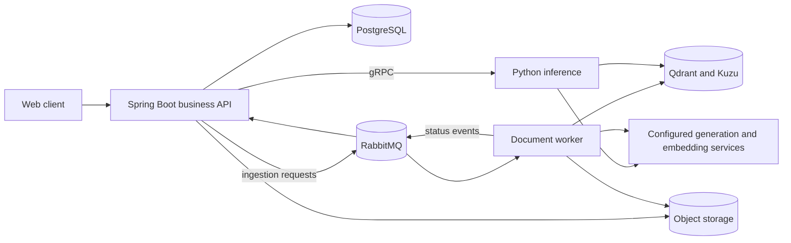

# OpenVie

OpenVie is a Vietnamese-first platform for self-hosted internal document-grounded RAG,
licensed under [Apache License 2.0](LICENSE). Review the
[open-source and distribution boundary](docs/OPEN_SOURCE.md) before publishing a fork.

For the current code, start with [local development](docs/DEVELOPMENT.md), then review the
[architecture](docs/ARCHITECTURE.md), [deployment guide](docs/DEPLOYMENT.md), and
[open-source boundary](docs/OPEN_SOURCE.md). Contributors: [CONTRIBUTING.md](CONTRIBUTING.md).

> OpenVie is the user-facing product name. Internal package/protobuf names, deployment
> resources, routes, credential prefixes, and existing domains intentionally retain their current
> identifiers. This presentation rebrand does not change integration contracts.

## Current scope

| Area | Current implementation boundary |
| --- | --- |
| Document-grounded chat | Tenant-scoped knowledge bases, conversations, citations, hybrid dense/sparse/graph retrieval, and completed JSON answers through the Spring API |
| Bounded sensitive route | Explicit Vietnamese/English risk keywords bypass semantic answer caches and require authorized source markers; structural check only, not a trained verifier or proof of source entailment |
| Ingestion | Asynchronous text-bearing PDF, DOCX, text, Markdown, HTML, CSV, and XLSX processing; source provenance, vector indexing, and graph projection |
| Identity and administration | Tenant registration, invitations, users and roles, login 2FA by email, notifications, and audit records |
| Offline evaluation | Local JSONL replay scores recorded decision, route, and citation outcomes against labeled anonymized traces; it does not call or train a model |
| Optional caches | Implemented but disabled by default; enable only after the applicable correctness and performance gates |
| Not delivered | OCR/image/audio/video ingestion, a Vietnamese-law corpus, Dream-RSI or a trained verifier, VLQA/SFT/QLoRA/DPO training, billing/payments, recruitment or interview workflows, an embeddable widget, a mobile client, platform administration, and production ingress; model adaptation remains research work |

Repository code alone is not evidence of a production-ready service: optional provider
integrations and deployment hardening must be verified in their own environment.

See the [ingestion and retrieval guide](docs/RETRIEVAL.md) for detailed boundaries.

The supplied four-plane architecture is a target: today's control, async data, and retrieval
planes run as described below; sensitive-question routing and offline trace evaluation add
bounded policy checks, not a trained legal or safety model. See [architecture status](docs/ARCHITECTURE.md#four-plane-target-and-delivered-boundary).

## Repository map

| Path | Responsibility | Start reading |
| --- | --- | --- |
| [`api/`](api/) | Java 21 / Spring Boot business API; PostgreSQL and tenant authorization | [Module guide](api/GUIDE.md) |
| [`rag-chatbot-fastapi/`](rag-chatbot-fastapi/) | Python inference, document workers, retrieval, and graph service | [Module guide](rag-chatbot-fastapi/GUIDE.md) |
| [`frontend/`](frontend/) | Next.js web client | [Web development](docs/DEVELOPMENT.md#start-the-applications) |
| [`contracts/`](contracts/) | Shared JSON event schemas and fixtures used across Java and Python | [Architecture and boundaries](docs/ARCHITECTURE.md) |
| [`proto/`](proto/) | Internal gRPC interface and message definitions | [Architecture and boundaries](docs/ARCHITECTURE.md) |
| [`docs/`](docs/) | Development, architecture, and feature references | [Documentation index](docs/README.md) |

## Architecture at a glance



Spring owns public business APIs, authorization, and persistent business state. Python owns
AI processing and derived indexes, not the business database. TLS termination and reverse
proxying are operator-owned and out of scope for this release; Redis supports counters,
checkpoints, and optional caches.

The [architecture reference](docs/ARCHITECTURE.md) contains deployment boundaries and detailed
chat and ingestion sequences. Language-specific module rules remain in the service guides.

## Run locally

Prerequisites: Git, Docker with Compose, Make, Java 21, Python 3.11 or 3.12, and a supported
Node.js LTS release with npm (Node 22.13 or newer on the 22.x line is a common baseline).

1. Follow [local setup](docs/DEVELOPMENT.md#local-setup) to create local configuration without
   overwriting existing files, install dependencies, start infrastructure, prepare models, and
   migrate/seed the development database.
2. Start each application in a **separate terminal**, from the repository root:

   ```bash
   # Business API: http://localhost:8080
   make -C api dev
   ```

   ```bash
   # AI HTTP: http://localhost:18000; internal gRPC: localhost:50051
   make -C rag-chatbot-fastapi dev PYTHON=python3.11
   ```

   ```bash
   # Web client: http://localhost:3000
   npm --prefix frontend run dev
   ```

3. Open the web client and follow the [first-run checks](docs/DEVELOPMENT.md#first-run-checks).

`make dev` in the Python service does **not** start Docker infrastructure. The separate
`make -C rag-chatbot-fastapi dev-infra` target does. Use `PYTHON=python3.12` instead if that
is your installed supported interpreter.

## Working on the code

| Change area | Rules and checks |
| --- | --- |
| Java | Read [`api/GUIDE.md`](api/GUIDE.md); `make -C api verify` |
| Python | Read [`rag-chatbot-fastapi/GUIDE.md`](rag-chatbot-fastapi/GUIDE.md); `make -C rag-chatbot-fastapi check PYTHON=python3.11` |
| Web | Scripts are in [`frontend/package.json`](frontend/package.json); see [verification](docs/DEVELOPMENT.md#verification) |
| Cross-service messages | Update the owning models, shared schemas/fixtures or protobuf source, generated outputs, and both consumers together |

Tests with real Redis, Qdrant, or external providers require their documented environments.
Read the [verification guide](docs/DEVELOPMENT.md#verification) before interpreting skipped
integration checks as successful end-to-end verification.

## Further reading

- [Documentation index](docs/README.md) — choose a guide by task.
- [Ingestion, models, and retrieval](docs/RETRIEVAL.md).
- [Deployment and self-hosting](docs/DEPLOYMENT.md).
- [Open-source licensing and distribution boundary](docs/OPEN_SOURCE.md).
- [Contributing](CONTRIBUTING.md) and [private vulnerability reporting](SECURITY.md).

## License

OpenVie application source is [Apache License 2.0](LICENSE), copyright 2026
LinkedNodeDigital; see [NOTICE](NOTICE). Anyone may self-host, fork, or sell hosting under
that license. Third-party packages, container images, services, model weights, and datasets
retain their own terms. Publishing a new public repository still requires the
[release review](docs/OPEN_SOURCE.md#publication-gate).
