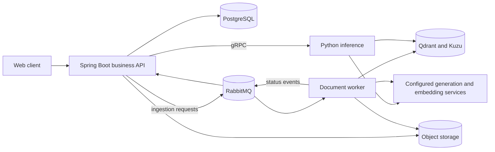

# OpenVie

> **Ngôn ngữ / Language:** [Tiếng Việt](#openvie--tổng-quan) · [English](#openvie-1)

---

## OpenVie — Tổng quan

OpenVie là nền tảng ưu tiên tiếng Việt để tự triển khai (self-host) RAG trên tài liệu nội bộ,
giấy phép [Apache License 2.0](LICENSE). Trước khi xuất bản fork, xem
[ranh giới nguồn mở và phân phối](docs/OPEN_SOURCE.md).

Với mã nguồn hiện tại: bắt đầu từ [phát triển cục bộ](docs/DEVELOPMENT.md), sau đó xem
[kiến trúc](docs/ARCHITECTURE.md), [hướng dẫn triển khai](docs/DEPLOYMENT.md), và
[ranh giới nguồn mở](docs/OPEN_SOURCE.md). Người đóng góp: [CONTRIBUTING.md](CONTRIBUTING.md).

[Ánh xạ DX-OS](docs/DX_OS.md) ghi nhận vị trí của repo này trong kiến trúc ba tầng DX-OS
Open-Core: dịch vụ lõi nào đã cung cấp, cái nào chưa, và mỗi màn hình web thuộc không gian
năng lực H-P-D-I nào.

> OpenVie là tên sản phẩm hướng tới người dùng. Tên package/protobuf nội bộ, tài nguyên triển
> khai, route, tiền tố thông tin đăng nhập và tên miền hiện có cố ý giữ nguyên định danh. Việc
> đổi thương hiệu trình bày này không thay đổi hợp đồng tích hợp.

## Phạm vi hiện tại

| Lĩnh vực | Ranh giới triển khai hiện có |
| --- | --- |
| Chat trên tài liệu | Knowledge base theo workspace, hội thoại, trích dẫn, truy hồi hỗn hợp dense/sparse/graph, câu trả lời JSON hoàn chỉnh qua Spring API |
| Tuyến nhạy cảm có giới hạn | Từ khóa rủi ro Việt/Anh tường minh bỏ qua bộ đệm câu trả lời ngữ nghĩa và yêu cầu marker nguồn được cấp quyền; chỉ kiểm tra cấu trúc, không phải trình xác minh đã huấn luyện |
| Hấp thụ tài liệu | Xử lý bất đồng bộ PDF, DOCX, văn bản, Markdown, HTML, CSV và XLSX có text; nguồn gốc tài liệu, đánh chỉ mục vector, ánh xạ đồ thị |
| Định danh và quản trị | Thiết lập web một lần, vòng đời tổ chức và workspace, phân quyền ba cấp (`ORG_OWNER`, `WORKSPACE_ADMIN`, `MEMBER`), lời mời, xác thực chỉ bằng mật khẩu, kênh email tùy chọn, nhật ký kiểm toán |
| Đánh giá ngoại tuyến | Chạy lại JSONL cục bộ chấm điểm quyết định, tuyến và trích dẫn trên trace ẩn danh có nhãn; không gọi hay huấn luyện model |
| Bộ đệm tùy chọn | Đã cài đặt nhưng tắt theo mặc định; chỉ bật sau các cổng kiểm chứng đúng đắn và hiệu năng |
| Chưa cung cấp | Hấp thụ OCR/ảnh/âm thanh/video, ngữ liệu luật Việt Nam, Dream-RSI hay trình xác minh đã huấn luyện, huấn luyện VLQA/SFT/QLoRA/DPO, thanh toán, quy trình tuyển dụng/phỏng vấn, widget nhúng, client di động, quản trị nền tảng, và kết thúc TLS hay WAF ở biên (cổng [APISIX](docs/DEPLOYMENT.md#9-edge-gateway-apache-apisix) chỉ định tuyến HTTP); thích ứng model vẫn là nghiên cứu |

Chỉ có mã nguồn trong repo chưa phải là bằng chứng dịch vụ production: tích hợp provider tùy
chọn và gia cố triển khai phải được kiểm chứng trong môi trường của riêng bạn.

Xem [hướng dẫn hấp thụ và truy hồi](docs/RETRIEVAL.md) cho ranh giới chi tiết.

### Mô hình vai trò

| Vai trò | Phạm vi | Thẩm quyền |
| --- | --- | --- |
| `ORG_OWNER` | Tổ chức | Đăng ký cài đặt qua `/setup`, quản lý thiết lập tổ chức (bật/tắt tự đăng ký, kênh email), tạo/đổi tên/lưu trữ workspace, xem tài khoản tổ chức, tạo trực tiếp tài khoản tổ chức thường, thêm tài khoản tổ chức hiện có vào workspace đang hoạt động, đặt lại mật khẩu ngoại tuyến qua `make recover-owner` |
| `WORKSPACE_ADMIN` | Workspace đang hoạt động | Mời và quản lý thành viên workspace, thêm tài khoản tổ chức hiện có vào workspace riêng/tư hoặc công khai đang hoạt động, đặt mật khẩu ban đầu, xóa bất kỳ tài liệu nào trong workspace |
| `MEMBER` | Workspace đang hoạt động | Trò chuyện, tải tài liệu lên, xóa tài liệu do mình tải lên; có thể thêm tài khoản tổ chức hiện có làm thành viên thường trong workspace công khai |

Kiến trúc bốn mặt phẳng là mục tiêu: hôm nay mặt phẳng điều khiển, dữ liệu bất đồng bộ và truy
hồi chạy như mô tả; định tuyến câu hỏi nhạy cảm và đánh giá trace ngoại tuyến chỉ thêm kiểm tra
chính sách có giới hạn, không phải model pháp lý/an toàn đã huấn luyện. Xem
[trạng thái kiến trúc](docs/ARCHITECTURE.md#four-plane-target-and-delivered-boundary).

## Sơ đồ kho mã

| Đường dẫn | Trách nhiệm | Bắt đầu đọc |
| --- | --- | --- |
| [`api/`](api/) | Java 21 / Spring Boot API nghiệp vụ; PostgreSQL, phân quyền workspace, kênh thông báo | [Module guide](api/GUIDE.md) |
| [`rag-chatbot-fastapi/`](rag-chatbot-fastapi/) | Suy luận Python, document worker, truy hồi, graph service | [Module guide](rag-chatbot-fastapi/GUIDE.md) |
| [`frontend/`](frontend/) | Web client Next.js | [Phát triển web](docs/DEVELOPMENT.md#start-the-applications) |
| [`contracts/`](contracts/) | Sự kiện JSON và fixture dùng chung giữa Java và Python | [Kiến trúc và ranh giới](docs/ARCHITECTURE.md) |
| [`proto/`](proto/) | Định nghĩa gRPC nội bộ | [Kiến trúc và ranh giới](docs/ARCHITECTURE.md) |
| [`docs/`](docs/) | Tài liệu phát triển, kiến trúc, tính năng | [Mục lục tài liệu](docs/README.md) |

## Kiến trúc tổng quan



Spring sở hữu API nghiệp vụ công khai, phân quyền và trạng thái nghiệp vụ bền vững. Python sở
hữu xử lý AI và chỉ mục phái sinh, không sở hữu database nghiệp vụ. Kết thúc TLS và reverse proxy
là việc của người vận hành, ngoài phạm vi bản phát hành này; Redis hỗ trợ bộ đếm, checkpoint và
bộ đệm tùy chọn.

[Tài liệu kiến trúc](docs/ARCHITECTURE.md) chứa ranh giới triển khai và chuỗi chat/hấp thụ chi
tiết. Quy tắc module theo ngôn ngữ nằm trong guide của từng service.

## Chạy cục bộ

Yêu cầu: Git, Docker kèm Compose, Make, Java 21, Python 3.11 hoặc 3.12, và Node.js LTS hỗ trợ
kèm npm (Node 22.13 trở lên trên nhánh 22.x là baseline phổ biến).

1. Làm theo [thiết lập cục bộ](docs/DEVELOPMENT.md#local-setup) để tạo cấu hình mà không ghi đè
   file có sẵn, cài dependency, khởi hạ tầng, chuẩn bị model, và migrate/seed database phát triển.
2. Chạy từng ứng dụng trong **terminal riêng**, từ thư mục gốc repo:

   ```bash
   # Business API: http://localhost:8080
   make -C api dev
   ```

   ```bash
   # AI HTTP: http://localhost:18000; gRPC nội bộ: localhost:50051
   make -C rag-chatbot-fastapi dev PYTHON=python3.11
   ```

   ```bash
   # Web client: http://localhost:3000
   npm --prefix frontend run dev
   ```

3. Mở web client và làm theo [kiểm tra lần đầu](docs/DEVELOPMENT.md#first-run-checks).

`make dev` của Python service **không** khởi Docker hạ tầng. Target riêng
`make -C rag-chatbot-fastapi dev-infra` mới khởi. Dùng `PYTHON=python3.12` nếu đó là interpreter
hỗ trợ bạn đã cài.

## Triển khai sản xuất (Production / Deployment)

Để triển khai toàn bộ nền tảng dưới dạng container khép kín trên máy chủ production, sử dụng
file `docker-compose.prod.yml`:

1. Chuẩn bị file cấu hình môi trường sản xuất:
   ```bash
   cp .env.production.example .env.production
   chmod 600 .env.production
   # Cập nhật các secret (TOKEN_KEY, mật khẩu DB, model endpoints...)
   ```
2. Khởi chạy toàn bộ hệ thống bằng Docker Compose:
   ```bash
   docker compose -f docker-compose.prod.yml --env-file .env.production up -d --build
   ```
3. Truy cập hệ thống qua cổng biên Apache APISIX tại `http://your-domain:8088` để hoàn tất thiết lập ban đầu (`/setup`).

Xem chi tiết tại [hướng dẫn triển khai (DEPLOYMENT.md)](docs/DEPLOYMENT.md).

## Làm việc với mã nguồn

| Lĩnh vực thay đổi | Quy tắc và kiểm tra |
| --- | --- |
| Java | Đọc [`api/GUIDE.md`](api/GUIDE.md); `make -C api verify` |
| Python | Đọc [`rag-chatbot-fastapi/GUIDE.md`](rag-chatbot-fastapi/GUIDE.md); `make -C rag-chatbot-fastapi check PYTHON=python3.11` |
| Web | Script trong [`frontend/package.json`](frontend/package.json); xem [verification](docs/DEVELOPMENT.md#verification) |
| Thông điệp liên service | Cập nhật model sở hữu, schema/fixture dùng chung hoặc protobuf, kết quả sinh ra, và cả hai phía tiêu thụ cùng lúc |

Test cần Redis, Qdrant hoặc provider thật yêu cầu môi trường được mô tả. Đọc
[hướng dẫn kiểm chứng](docs/DEVELOPMENT.md#verification) trước khi hiểu check tích hợp bị skip
là kiểm chứng end-to-end thành công.

## Đọc thêm

- [Mục lục tài liệu](docs/README.md) — chọn guide theo việc cần làm.
- [Hấp thụ, model, truy hồi](docs/RETRIEVAL.md).
- [Triển khai và self-hosting](docs/DEPLOYMENT.md).
- [Ranh giới giấy phép và phân phối nguồn mở](docs/OPEN_SOURCE.md).
- [Đóng góp](CONTRIBUTING.md) và [báo cáo lỗ hổng riêng tư](SECURITY.md).

## Giấy phép

Mã nguồn ứng dụng OpenVie là [Apache License 2.0](LICENSE), bản quyền 2026
LinkedNodeDigital; xem [NOTICE](NOTICE). Ai cũng có thể tự triển khai, fork hay bán hosting theo
giấy phép đó. Package bên thứ ba, container image, service, model weights và dataset giữ điều
khoản riêng. Xuất bản repo công khai mới vẫn yêu cầu
[review phát hành](docs/OPEN_SOURCE.md#publication-gate).

---

# OpenVie

OpenVie is a Vietnamese-first platform for self-hosted internal document-grounded RAG,
licensed under [Apache License 2.0](LICENSE). Review the
[open-source and distribution boundary](docs/OPEN_SOURCE.md) before publishing a fork.

For the current code, start with [local development](docs/DEVELOPMENT.md), then review the
[architecture](docs/ARCHITECTURE.md), [deployment guide](docs/DEPLOYMENT.md), and
[open-source boundary](docs/OPEN_SOURCE.md). Contributors: [CONTRIBUTING.md](CONTRIBUTING.md).

The [DX-OS mapping](docs/DX_OS.md) records how this repository sits in the three-tier DX-OS
Open-Core architecture: which headless core services are delivered, which are not, and which
H-P-D-I capability space each screen of the web client belongs to.

> OpenVie is the user-facing product name. Internal package/protobuf names, deployment
> resources, routes, credential prefixes, and existing domains intentionally retain their current
> identifiers. This presentation rebrand does not change integration contracts.

## Current scope

| Area | Current implementation boundary |
| --- | --- |
| Document-grounded chat | Workspace-scoped knowledge bases, conversations, citations, hybrid dense/sparse/graph retrieval, and completed JSON answers through the Spring API |
| Bounded sensitive route | Explicit Vietnamese/English risk keywords bypass semantic answer caches and require authorized source markers; structural check only, not a trained verifier or proof of source entailment |
| Ingestion | Asynchronous text-bearing PDF, DOCX, text, Markdown, HTML, CSV, and XLSX processing; source provenance, vector indexing, and graph projection |
| Identity and administration | One-time web setup, organization and workspace lifecycle, three-role access control (`ORG_OWNER`, `WORKSPACE_ADMIN`, `MEMBER`), invitations, password-only authentication, optional email notification channels, and audit records |
| Offline evaluation | Local JSONL replay scores recorded decision, route, and citation outcomes against labeled anonymized traces; it does not call or train a model |
| Optional caches | Implemented but disabled by default; enable only after the applicable correctness and performance gates |
| Not delivered | OCR/image/audio/video ingestion, a Vietnamese-law corpus, Dream-RSI or a trained verifier, VLQA/SFT/QLoRA/DPO training, billing/payments, recruitment or interview workflows, an embeddable widget, a mobile client, platform administration, and TLS termination or WAF hardening at the edge (the [APISIX gateway](docs/DEPLOYMENT.md#9-edge-gateway-apache-apisix) routes HTTP only); model adaptation remains research work |

Repository code alone is not evidence of a production-ready service: optional provider
integrations and deployment hardening must be verified in their own environment.

See the [ingestion and retrieval guide](docs/RETRIEVAL.md) for detailed boundaries.

### Role model

| Role | Scope | Authority |
| --- | --- | --- |
| `ORG_OWNER` | Organization | Claims install via `/setup`, manages organization settings (self-registration toggle, email channels), creates/renames/archives workspaces, views organization accounts, creates regular organization accounts directly, adds existing organization accounts to the active workspace, offline password reset via `make recover-owner` |
| `WORKSPACE_ADMIN` | Active workspace | Invites and manages workspace members, adds existing organization accounts to the active private or public workspace, sets initial passwords, deletes any document in the workspace |
| `MEMBER` | Active workspace | Queries chat, uploads documents, deletes own uploaded documents; may add an existing organization account as a regular member in a public workspace |

The supplied four-plane architecture is a target: today's control, async data, and retrieval
planes run as described below; sensitive-question routing and offline trace evaluation add
bounded policy checks, not a trained legal or safety model. See [architecture status](docs/ARCHITECTURE.md#four-plane-target-and-delivered-boundary).

## Repository map

| Path | Responsibility | Start reading |
| --- | --- | --- |
| [`api/`](api/) | Java 21 / Spring Boot business API; PostgreSQL, workspace authorization, and notification channels | [Module guide](api/GUIDE.md) |
| [`rag-chatbot-fastapi/`](rag-chatbot-fastapi/) | Python inference, document workers, retrieval, and graph service | [Module guide](rag-chatbot-fastapi/GUIDE.md) |
| [`frontend/`](frontend/) | Next.js web client | [Web development](docs/DEVELOPMENT.md#start-the-applications) |
| [`contracts/`](contracts/) | Shared JSON event schemas and fixtures used across Java and Python | [Architecture and boundaries](docs/ARCHITECTURE.md) |
| [`proto/`](proto/) | Internal gRPC interface and message definitions | [Architecture and boundaries](docs/ARCHITECTURE.md) |
| [`docs/`](docs/) | Development, architecture, and feature references | [Documentation index](docs/README.md) |

## Architecture at a glance


Spring owns public business APIs, authorization, and persistent business state. Python owns
AI processing and derived indexes, not the business database. TLS termination and reverse
proxying are operator-owned and out of scope for this release; Redis supports counters,
checkpoints, and optional caches.

The [architecture reference](docs/ARCHITECTURE.md) contains deployment boundaries and detailed
chat and ingestion sequences. Language-specific module rules remain in the service guides.

## Run locally

Prerequisites: Git, Docker with Compose, Make, Java 21, Python 3.11 or 3.12, and a supported
Node.js LTS release with npm (Node 22.13 or newer on the 22.x line is a common baseline).

1. Follow [local setup](docs/DEVELOPMENT.md#local-setup) to create local configuration without
   overwriting existing files, install dependencies, start infrastructure, prepare models, and
   migrate/seed the development database.
2. Start each application in a **separate terminal**, from the repository root:

   ```bash
   # Business API: http://localhost:8080
   make -C api dev
   ```

   ```bash
   # AI HTTP: http://localhost:18000; internal gRPC: localhost:50051
   make -C rag-chatbot-fastapi dev PYTHON=python3.11
   ```

   ```bash
   # Web client: http://localhost:3000
   npm --prefix frontend run dev
   ```

3. Open the web client and follow the [first-run checks](docs/DEVELOPMENT.md#first-run-checks).

`make dev` in the Python service does **not** start Docker infrastructure. The separate
`make -C rag-chatbot-fastapi dev-infra` target does. Use `PYTHON=python3.12` instead if that
is your installed supported interpreter.

## Production deployment

To deploy the entire platform as a self-contained containerized stack on a production host,
use `docker-compose.prod.yml`:

1. Prepare the production environment configuration:
   ```bash
   cp .env.production.example .env.production
   chmod 600 .env.production
   # Update secrets (TOKEN_KEY, DB passwords, model endpoints...)
   ```
2. Start all services with Docker Compose:
   ```bash
   docker compose -f docker-compose.prod.yml --env-file .env.production up -d --build
   ```
3. Access the web console via Apache APISIX at `http://your-domain:8088` to complete initial setup (`/setup`).

For details on operations, backups, and security hardening, see the [deployment guide](docs/DEPLOYMENT.md).

## Working on the code

| Change area | Rules and checks |
| --- | --- |
| Java | Read [`api/GUIDE.md`](api/GUIDE.md); `make -C api verify` |
| Python | Read [`rag-chatbot-fastapi/GUIDE.md`](rag-chatbot-fastapi/GUIDE.md); `make -C rag-chatbot-fastapi check PYTHON=python3.11` |
| Web | Scripts are in [`frontend/package.json`](frontend/package.json); see [verification](docs/DEVELOPMENT.md#verification) |
| Cross-service messages | Update the owning models, shared schemas/fixtures or protobuf source, generated outputs, and both consumers together |

Tests with real Redis, Qdrant, or external providers require their documented environments.
Read the [verification guide](docs/DEVELOPMENT.md#verification) before interpreting skipped
integration checks as successful end-to-end verification.

## Further reading

- [Documentation index](docs/README.md) — choose a guide by task.
- [Ingestion, models, and retrieval](docs/RETRIEVAL.md).
- [Deployment and self-hosting](docs/DEPLOYMENT.md).
- [Open-source licensing and distribution boundary](docs/OPEN_SOURCE.md).
- [Contributing](CONTRIBUTING.md) and [private vulnerability reporting](SECURITY.md).

## License

OpenVie application source is [Apache License 2.0](LICENSE), copyright 2026
LinkedNodeDigital; see [NOTICE](NOTICE). Anyone may self-host, fork, or sell hosting under
that license. Third-party packages, container images, services, model weights, and datasets
retain their own terms. Publishing a new public repository still requires the
[release review](docs/OPEN_SOURCE.md#publication-gate).
