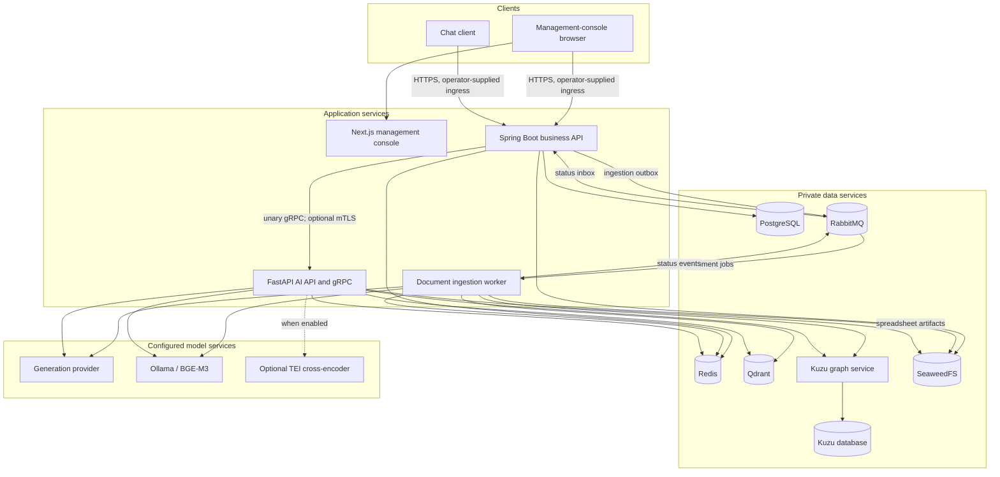
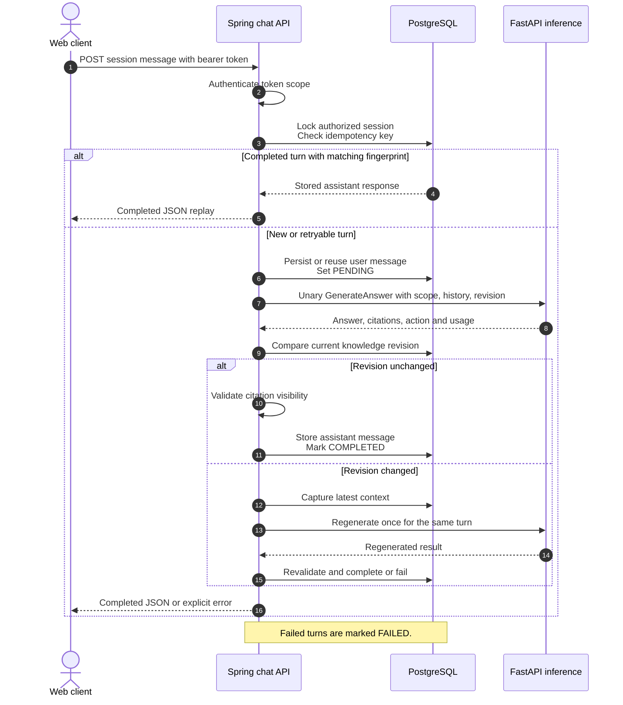
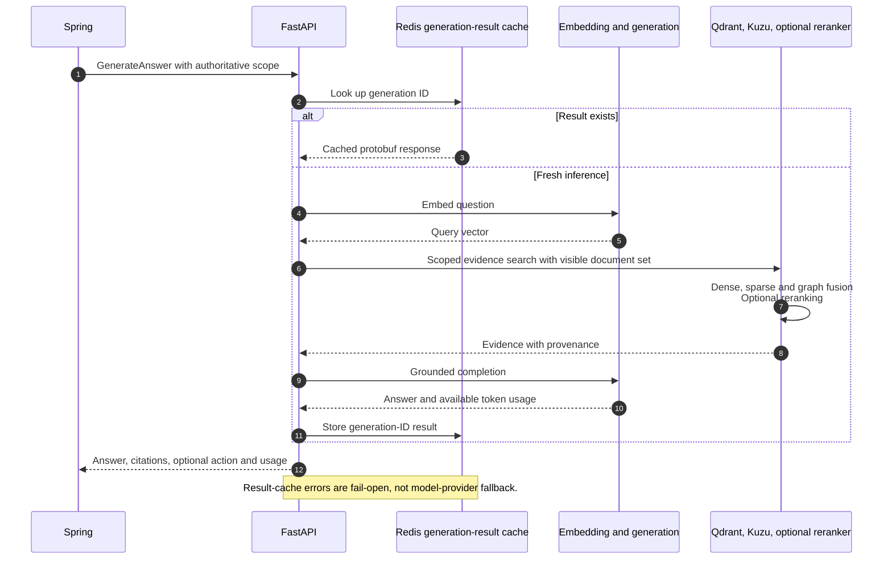
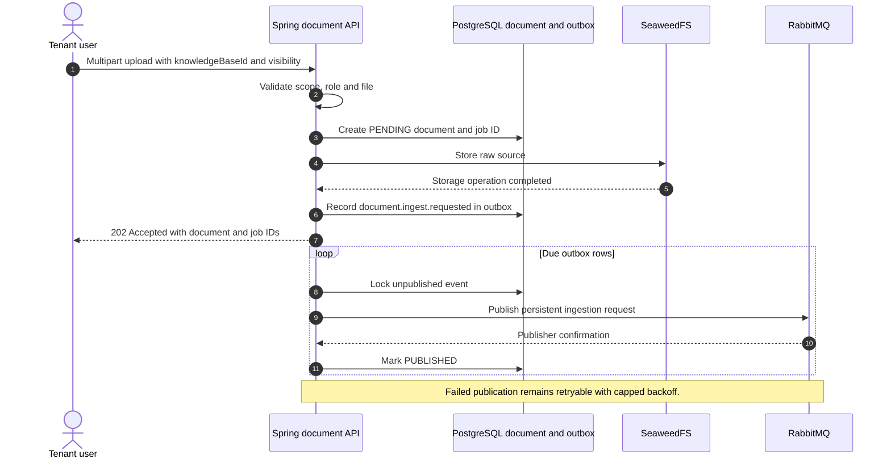
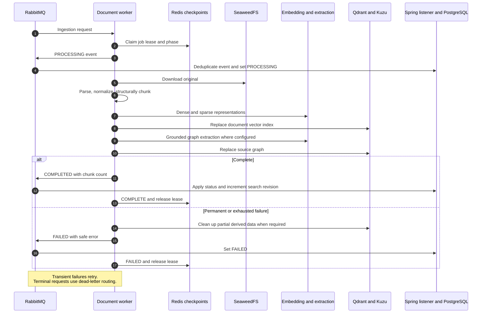

# OpenVie architecture

[Documentation index](README.md) · [Development](DEVELOPMENT.md) · [Deployment](DEPLOYMENT.md)

This reference describes the delivered support-chat and document-ingestion runtime, its trust boundaries, and operational objectives. Retrieval mechanics belong in [Retrieval](RETRIEVAL.md); cache policy is summarized under [Caches](#caches) below.

## Contents

- [Runtime topology](#runtime-topology)
- [Four-plane target and delivered boundary](#four-plane-target-and-delivered-boundary)
- [Responsibilities and boundaries](#responsibilities-and-boundaries)
- [Caches](#caches)
- [Chat request sequences](#chat-request-sequences)
- [Document ingestion sequences](#document-ingestion-sequences)
- [Data ownership and provenance](#data-ownership-and-provenance)
- [Security and isolation](#security-and-isolation)
- [Operational objectives](#operational-objectives)
- [Retired architectural claims](#retired-architectural-claims)

## Runtime topology



The diagram is a support-chat view. Dashed edges are conditional capabilities. The document worker can run embedded in the Python process or as a dedicated consumer; its in-flight limit is `INGESTION_WORKER_CONCURRENCY`, so multiple documents can be processed at once when the model server supports parallel requests. General-purpose OCR, ASR, vision, audio, and video ingestion workers are **not delivered pipelines**: their lifecycle entries are scaffold mode in [worker bootstrap](../rag-chatbot-fastapi/app/bootstrap/workers.py).

### Deployment and model boundaries

This release delivers one Compose file, [Local Compose](../docker-compose.yml), which starts the
data services, SeaweedFS, and the graph service and intentionally publishes development ports on
localhost. Native Ollama runs outside Docker so Apple Silicon installations can use Metal
acceleration. Optional reranking uses one TEI `/rerank` contract with platform-specific runtimes:
Compose on Linux and Windows WSL2, and native TEI with Metal on Apple Silicon. Reverse-proxy/TLS
ingress, hardened network segmentation, and edge rate limiting are operator-owned: see
[Deployment](DEPLOYMENT.md). There is no production Compose file, gateway configuration, or
deployment script in this repository. Public chat does not expose Qdrant, Kuzu, Ollama, TEI, or
model-provider credentials.

“Managed AI” means **operator-selected and operated integration**, not necessarily self-hosted
inference. The [model adapter factory](../rag-chatbot-fastapi/app/modules/model/internal/chat.py)
supports Ollama and Qwen (OpenAI-compatible endpoints). The delivered default path is native
Ollama with Arcee-VyLinh generation and BGE-M3 embeddings. The optional reranker defaults to the
TEI-compatible `Alibaba-NLP/gte-multilingual-reranker-base`, remains disabled until explicitly
configured, and preserves fused retrieval order on failure. Operator configuration can point the
adapters at other compatible endpoints, so tenant content may then be sent across that provider's
boundary. Provider selection is deployment configuration, not a per-request customer endpoint.
There is no automatic generation-provider failover.

## Four-plane target and delivered boundary

The proposed architecture has four planes. Only the paths marked **delivered** below are
executable in this repository; naming a component in the target does not create a model,
licensed dataset, or an operational safety guarantee.

| Plane | Delivered here | Not delivered by this repository |
|---|---|---|
| Control | Spring Boot workspace/auth/chat API, PostgreSQL authoritative state (organizations, workspaces, memberships, notification channels), Redis scoped runtime state. `model_config_versions` stores chatbot model metadata, while the Python model adapter is selected by deployment configuration. | A control-plane-managed, evaluated model/policy promotion service that dynamically switches the inference model. |
| Async data | RabbitMQ ingestion requests/status, document workers, SeaweedFS source objects, Qdrant vectors and Kuzu graph projections. | General OCR, image, audio, or video ingestion pipelines. |
| Inference | Spring calls internal FastAPI/gRPC generation; a bounded Vietnamese/English keyword route applies extra evidence and citation-marker checks for sensitive questions; tenant-scoped RAG retrieves Qdrant/Kuzu evidence; configured provider generates answers. | A trained Dream-RSI policy runtime or verifier model, an installed Vietnamese-law corpus/retriever, or guaranteed legal/medical/financial safety. Provider choice is a deployment setting, not a tenant-selected vLLM checkpoint. |
| Offline alignment | The local recorded-trace evaluator measures answer/abstention decisions, sensitive-route labels, and citation-marker validity without sending traces to a provider. | Discovery-tree replay, VLQA labeling, SFT/QLoRA/DPO, model training, automatic candidate promotion, or published benchmark results. |

The sensitive route is a **lexical guardrail** (`sensitive-keyword-v1`) over the latest
question only, not a general-purpose risk classifier: unmatched wording and follow-ups
without a keyword take the normal RAG path. Sensitive answers require
at least one authorized retrieved citation marker; missing evidence or invented source IDs
abstain. This check cannot prove that a cited passage actually entails every claim, so human
review is required for high-stakes use. Retrieved documents stay restricted to visible document
IDs; semantic answer cache lookup and spreadsheet calculations are skipped for the sensitive route. The offline evaluator uses the same router and citation
check but does not train a model or activate results automatically.

## Responsibilities and boundaries

| Component | Implemented responsibility |
|---|---|
| Next.js console | Account, knowledge-base, document, and chat management surfaces |
| Spring business API | Public REST contracts, authentication and tenant scope, workspace, documents, sessions/messages/turns, citation visibility, notifications, and PostgreSQL writes |
| FastAPI generation | Internal unary gRPC, retrieval/context assembly, model invocation, result deduplication, document-unit reads and derived-index cleanup |
| Document worker | Raw-source download, digital document parsing, structural chunking, dense/sparse encoding, graph extraction, checkpointed status publication |
| Generation provider | Grounded completion and model-backed extraction where selected; not necessarily Gemma |
| Embedding service | Query/document dense embeddings; application adapters own normalization and cache identity |
| Graph service | Kuzu schema, graph replacement, scoped traversal, evidence links |
| PostgreSQL | Authoritative business, identity, document, chat, and audit metadata |
| Qdrant / Kuzu | Materialized vector and graph retrieval data derived from uploaded sources |
| SeaweedFS | Raw uploaded objects and implemented derived artifacts |
| Redis | Optional read/result caches and rate limiting, plus correctness-relevant ingestion lease/checkpoint state |
| RabbitMQ | Durable asynchronous commands/events, publication confirmation, retries and dead-letter routing |

Redis is not uniformly an expendable cache. Optional cache failures can fall through to authoritative loaders; ingestion leases and checkpoints have different failure semantics. Do not extrapolate cache fail-open behavior to all Redis consumers.

## Caches

Every optional cache is off on a fresh install. Enable one at a time through the matching flags in [`api/.env.example`](../api/.env.example) (Spring: business-read, workspace, user-directory, document-list, embedding, retrieval) and [`rag-chatbot-fastapi/.env.example`](../rag-chatbot-fastapi/.env.example) (Python: embedding, retrieval, generation-result, semantic answer), then observe correctness and latency under your own workload.

- Cache failures are **fail-open**: a Redis error falls back to the authoritative loader rather than failing the request. Rate limiting also fails open; authoritative business state in PostgreSQL stays the source of truth.
- Cache keys are scoped by tenant and by the revision identity of the underlying data (for example knowledge-base revision and content hashes). Ingestion changes bump those revisions, so stale entries are not reused; do not remove revision identity to gain hit rate.
- The semantic answer cache additionally requires a similarity threshold and can be left in `off` mode. The retrieval cache fingerprint includes a pipeline version, isolating older derived entries without a global prefix change.
- Never flush Redis as a cache rollback: ingestion leases/checkpoints live in the same instance. Disable the narrowest flag, restart the owning service, and re-measure.
- Cache metrics use hashed key identities and bounded labels; never add raw tenant text or tokens to metric labels.

### LangChain boundary

LangChain is an internal model-orchestration dependency, not the public API, authorization system, job scheduler, model host, or business database. The current [model adapter](../rag-chatbot-fastapi/app/modules/model/internal/chat.py) converts project messages to LangChain messages and uses `ChatOpenAI`; the public project-owned [model API](../rag-chatbot-fastapi/app/modules/model/api/__init__.py) exposes `ChatModelApi.complete`, `complete_with_usage`, and `TextEmbeddingApi`.

An adapter's ability to stream does **not** create a public streaming contract. The support-chat transport returns completed JSON after unary gRPC generation. Media routing, OCR, and audio retrieval in old LangChain examples were proposed extensions, not capabilities of the current support-chat API.

For language-specific dependency rules and module boundaries, use the [Java guide](../api/GUIDE.md) and [Python guide](../rag-chatbot-fastapi/GUIDE.md), rather than copying an alternative port hierarchy here.

## Chat request sequences

### 1. Request control and persistence



[ChatControlPlaneService](../api/src/main/java/com/cacanode/api/chat/query/ChatControlPlaneService.java) owns this state machine. Idempotency is session-scoped, not a blanket guarantee for every POST. A pending duplicate returns `MESSAGE_IN_PROGRESS`; changed content under the same key returns `IDEMPOTENCY_KEY_REUSED`. A second revision change returns `KNOWLEDGE_BASE_CHANGED`. Replays use stored content; evidence URLs can be generated when serializing the response, so do not assume byte-identical responses forever.

### 2. Inference and retrieval



The generation ID deduplicates completed internal results. It is distinct from retrieval caching and the optional semantic answer cache; the old blanket claim that generated answers are never cached is incorrect. Enablement, TTLs, key scope, revision identity and invalidation are covered in [Caches](#caches). See [Retrieval](RETRIEVAL.md) for the algorithms instead of treating this sequence as a ranking specification.

## Document ingestion sequences

### 1. Acceptance and durable publication



Acceptance is not completion. [DocumentService](../api/src/main/java/com/cacanode/api/document/service/DocumentService.java), the [outbox relay](../api/src/main/java/com/cacanode/api/document/messaging/InternalEventOutboxRelay.java), and the [status listener](../api/src/main/java/com/cacanode/api/document/messaging/DocumentStatusEventListener.java) separate storage acceptance, durable publication, and authoritative ingestion status. Object storage and PostgreSQL are not a single distributed transaction; failure handling must be understood from these paths, not assumed atomic across stores.

### 2. Indexing and status propagation



[Worker transport](../rag-chatbot-fastapi/app/modules/ingestion/transport/rabbitmq.py) tracks resumable phases and [the pipeline](../rag-chatbot-fastapi/app/modules/ingestion/internal/pipeline.py) owns index/artifact replacement and cleanup. Deletion also coordinates raw-object and derived-index removal; a failure can require recovery rather than implying instantaneous cross-store erasure.

## Data ownership and provenance

### Business records versus derived evidence

PostgreSQL is Spring-owned. The implemented core includes organization, workspace, workspace membership, user account, and invitation records, knowledge bases and chatbots with `model_config_versions`, documents, sessions/messages/turns with serialized citations, refresh tokens, notification channels, outbox/inbox rows, and audit records. “Source,” “KnowledgeUnit,” “RoleAssignment,” and “UsageRecord” in conceptual designs are not promises of identically named database entities. Consult [database migrations](../api/src/main/resources/db/migration) and the owning modules for persistence shape.

A chat session records tenant, chatbot, knowledge base, channel, and either an authenticated user or no user (anonymous session rows are not a credential). `customer_metadata` is descriptive only; it does not replace the credential ownership check. The delivered workspace provisions a default knowledge base and active chatbot; it is not a public multiple-chatbot CRUD contract.

### Object storage

Current document originals use this key shape from [DocumentService](../api/src/main/java/com/cacanode/api/document/service/DocumentService.java):

```text
tenants/{tenant_id}/knowledge-bases/{knowledge_base_id}/documents/{document_id}/{safe_filename}
```

Raw keys are not public URLs. [SeaweedFS storage](../api/src/main/java/com/cacanode/api/common/storage/SeaweedFsDocumentStorage.java) is accessed through backend services. Authorized document download and scoped public-evidence access are separate from arbitrary bucket access. Spreadsheet artifacts have their own [key helpers](../rag-chatbot-fastapi/app/common/storage_keys.py) and [artifact implementation](../rag-chatbot-fastapi/app/modules/ingestion/internal/artifacts.py). Proposed OCR images, keyframes, audio windows and transcripts are not a current universal object-layout contract.

### Index units and graph evidence

The actual normalized index contract is [IndexUnit / ReplaceDocumentIndex](../rag-chatbot-fastapi/app/modules/index/api/__init__.py). Units carry text, stable unit identity, content hash, source name, modality, block type, structural section context, and applicable page/sheet/cell/table/character-offset provenance. Tenant, knowledge-base and document scope are supplied by the replacement command.

[Qdrant index commands](../rag-chatbot-fastapi/app/modules/index/internal/qdrant_commands.py) create named dense vectors with cosine distance and sparse vectors with IDF, reject incompatible dimensions or missing vector names, and index tenant, knowledge-base, document and chunk fields. Payloads include parser/chunker versions and content hashes. They do **not** universally record every model checkpoint, adapter, tokenizer, OCR and ASR version proposed in earlier designs. Embedding identity and safe migration require explicit configuration and reindex planning; dimensional compatibility alone is not semantic compatibility.

Kuzu stores graph units, entities, relations and evidence links. Graph results must remain scoped and grounded in retrieved document evidence; the former illustrative `Policy`/`Product` graph was not a schema listing. See [Retrieval](RETRIEVAL.md) for the actual graph/index contracts and reindex guidance. Do not use the retired `app.maintenance.reindex_documents` command: that module is absent, and its proposed direct PostgreSQL access contradicts the current boundary.

## Security and isolation

### Implemented controls and their limits

- **Dashboard identity:** JWT-based management authentication with refresh-token rotation, active-workspace scoping, and password-only authentication (`ORG_OWNER`, `WORKSPACE_ADMIN`, `MEMBER`). Follow the [auth controller](../api/src/main/java/com/cacanode/api/auth/controller/AuthController.java) and [security configuration](../api/src/main/java/com/cacanode/api/bootstrap/config/SecurityConfig.java) for route and role policy. Public exposure is limited to the auth routes, one-time setup (`/setup`), and health/info; see the rate-limit and trusted-proxy settings in [`application.yaml`](../api/src/main/resources/application.yaml).
- **Tenant and visibility scope:** Spring resolves authorized workspace/session ownership and passes tenant, knowledge-base and permitted document IDs to inference. Qdrant and graph adapters scope reads; Spring validates citation visibility again before storing the answer. Tenant IDs supplied by clients do not independently authorize access.
- **Uploads:** the [file validator](../api/src/main/java/com/cacanode/api/document/service/DocumentFileValidator.java) checks extension/content-type compatibility, PDF/Office signatures, UTF-8 text, unsafe archive paths, entry counts and decompressed-byte limits. [DocumentService](../api/src/main/java/com/cacanode/api/document/service/DocumentService.java) enforces the non-empty/20 MB size limit, supported extension, and an active knowledge base; a `WORKSPACE_ADMIN` can delete any document in the workspace, while a `MEMBER` can delete only documents they uploaded. Tenant `max_documents`/`max_messages`/`max_storage_mb` columns exist but are not enforced by a quota service. These are not evidence of antivirus scanning or sandboxed parser execution.
- **Rendering and AI context:** the web client renders chat content as text through React nodes and builds citation links separately. Retrieved documents are untrusted evidence. Prompt separation and citation validation reduce risk; they cannot guarantee that prompt injection is impossible.
- **Internal transport:** gRPC between Spring and Python is plaintext in the `dev` profile; the `prod` profile defaults to certificate-authenticated TLS with `AI_GRPC_PLAINTEXT=false` and `AI_GRPC_*` certificate paths. Set them explicitly for your topology: plaintext is only appropriate when both processes are on a host you control. Do not put provider credentials, raw tokens or uploaded content into public responses, logs or analytics.

### Audit and deployment responsibilities

Audit records are owned by Spring and emitted through the implemented [audit recorder](../api/src/main/java/com/cacanode/api/common/service/SynchronousAuditRecorder.java) and [action taxonomy](../api/src/main/java/com/cacanode/api/common/enums/LogAction.java). Those sources, rather than an aspirational list, define coverage. Neither this document nor the repository alone proves exhaustive audit coverage, secret-store operation, malware scanning, database row-level security, parser network isolation or production retention compliance.

For operational secrets, transport configuration, backup/recovery and exposure checks, use [Deployment](DEPLOYMENT.md). A configured external generation provider must be reflected in data-handling disclosures; “no external AI provider ever receives tenant data” is not a valid security claim.

## Operational objectives

### Targets, not measurements

The prior design proposed these planning targets. They are **not measured guarantees, capacity certification or an SLA**:

| Operation | Proposed objective | Measurement qualification |
|---|---|---|
| Upload acknowledgement | p95 ≤ 2 seconds | Includes the synchronous upload/storage path; excludes background indexing; declare file sizes and network conditions |
| Console initial load | p95 ≤ 3 seconds | Define device, network, cold/warm cache and page |
| Concurrent chat sessions | 50 without material degradation | Define active-turn concurrency, model, context size and acceptable latency/error thresholds |

The previous “p95 first streamed token ≤ 3 seconds” and SSE-heartbeat targets do not apply to the completed-JSON API. Measure end-to-end completed-turn latency instead; no replacement numeric guarantee is asserted here. Report cold starts, context size, provider throttling, GPU saturation, reindex load and dependency failures separately.

### Scaling and failure behavior

- Spring owns durable control-plane state; FastAPI owns inference orchestration. Additional replicas still need shared stores, correct locking and per-process resource limits; “stateless” is not proof of unlimited horizontal scaling.
- Document consumers can be separated from request-serving processes; RabbitMQ and checkpoint leases control work delivery. Non-document modality workers cannot provide ingestion capacity merely by being started.
- Model scaling is provider-specific. Qdrant index tuning and graph-service concurrency must be evaluated with real workload evidence.
- Public chat returns explicit mapped failures rather than silently selecting another provider. Use the [chat error handler](../api/src/main/java/com/cacanode/api/chat/exception/ChatApiExceptionHandler.java) and [control-plane service](../api/src/main/java/com/cacanode/api/chat/query/ChatControlPlaneService.java) for actual status/code pairs; not every model error is `503 MODEL_UNAVAILABLE`.
- Optional cache reads/result caching and the [public rate limiter](../api/src/main/java/com/cacanode/api/common/filter/PublicRateLimitFilter.java) fail open on Redis errors. Authoritative business state remains in PostgreSQL; ingestion checkpoint/lease consumers are not covered by that promise.
- Ingestion recovery is bounded by its own retry, lease, and dead-letter rules, not one universal backoff policy.

### Observability

[AI metrics](../rag-chatbot-fastapi/app/common/metrics.py) and Java service instrumentation are the source of truth for metric names and labels. Monitor completed-turn latency/errors, model timeouts and available token usage, retrieval latency/counts, ingestion completion/failure and retry state, and store/queue health.

The old list of TTFT, GPU utilization, every modality latency and universal structured-log fields described desired coverage, not proof that all exporters and dashboards exist. Treat additional provider/GPU/queue exporters and production alerts as deployment work. Cache metrics use controlled labels and hashed key identities; never add raw tenant text, tokens or high-cardinality identifiers to metric labels (see [Caches](#caches)).

## Retired architectural claims

This split deliberately removes contradictory guarantees rather than archiving them as current behavior: universal SSE; self-hosted-only Gemma; fully working OCR/ASR/vision/audio/video ingestion; universal multimodal artifacts/model registries; the absent Python PostgreSQL reindex command; antivirus/parser-sandbox assertions; universal audit/observability coverage; billing, payment, recruitment, interview, widget and platform-administration surfaces; and measured performance claims without results. Runnable current contracts are described by the [module guides](../api/GUIDE.md) and [retrieval reference](RETRIEVAL.md), while remaining ideas are only proposals and are labeled as such above.
