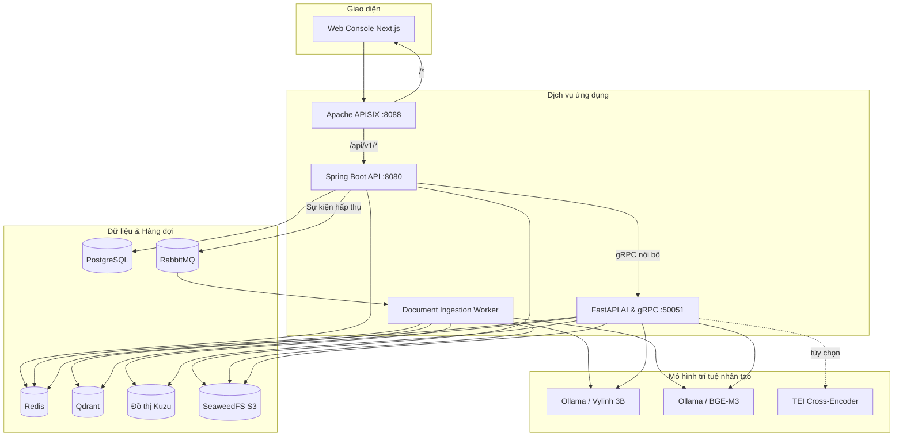

# OpenVie architecture

[Documentation index](README.md) · [Development](DEVELOPMENT.md) · [Deployment](DEPLOYMENT.md)

> **Ngôn ngữ / Language:** [Tiếng Việt](#kiến-trúc-openvie--tiếng-việt) · [English](#openvie-architecture-1)

---

## Kiến trúc OpenVie — Tiếng Việt

Tài liệu này mô tả kiến trúc runtime hỗ trợ chat và hấp thụ tài liệu, ranh giới tin cậy và phân định trách nhiệm.

### 1. Tô-pô hệ thống (Topology)

### 2. Mô hình 4 mặt phẳng (Four-Plane Boundary)

| Mặt phẳng | Hiện trạng đã có | Chưa cung cấp |
|---|---|---|
| **Điều khiển (Control)** | Spring Boot quản lý tổ chức, workspace, tài khoản, phân quyền 3 cấp (`ORG_OWNER`, `WORKSPACE_ADMIN`, `MEMBER`), kênh thông báo, phiên chat và lưu trữ PostgreSQL. | Dịch vụ điều phối chuyển đổi checkpoint model động. |
| **Dữ liệu bất đồng bộ** | RabbitMQ điều phối hàng đợi, worker xử lý đa luồng, SeaweedFS lưu trữ file gốc, Qdrant lưu vector, Kuzu lưu đồ thị. | Xử lý OCR, hình ảnh, âm thanh, video tổng quát. |
| **Suy luận (Inference)** | FastAPI xử lý gRPC unary, RAG ngữ cảnh theo tenant, router từ khóa nhạy cảm, LLM sinh câu trả lời có trích dẫn nguồn. | Mô hình Verifier đã huấn luyện, ngữ liệu pháp luật Việt Nam độc lập, tự động failover giữa các nhà cung cấp cloud. |
| **Đánh giá ngoại tuyến** | Công cụ chạy lại trace JSONL đo đạc nhãn nhạy cảm, độ chuẩn xác của trích dẫn mà không cần gọi API model. | Pipeline huấn luyện SFT/DPO/QLoRA, bộ benchmark tự động công bố. |

### 3. Phân định trách nhiệm dữ liệu

- **PostgreSQL (Spring sở hữu):** Lưu trữ chính thống về tổ chức, người dùng, workspace, phiên hội thoại, tin nhắn, nhật ký kiểm toán, kênh thông báo và outbox/inbox sự kiện bền vững.
- **Qdrant & Kuzu (Python sở hữu):** Lưu trữ chỉ mục vector (dense/sparse) và đồ thị quan hệ phái sinh từ tài liệu. Không chứa dữ liệu nghiệp vụ thuần túy.
- **SeaweedFS (S3):** Chứa tệp tài liệu gốc và bảng Parquet phái sinh từ bảng tính.
- **Redis:** Lưu trữ tạm bộ đệm (mặc định tắt), checkpoint và lease trạng thái xử lý của ingestion worker.

### 4. Chuỗi tương tác chính

#### A. Xử lý yêu cầu trò chuyện (Chat Sequence)
1. Client gửi câu hỏi kèm JWT tới Spring Boot qua Gateway APISIX.
2. Spring xác thực quyền workspace, kiểm tra khóa idempotency, lưu trạng thái `PENDING`.
3. Spring gọi gRPC `GenerateAnswer` sang Python FastAPI kèm ngữ cảnh và lịch sử gần nhất.
4. Python viết lại truy vấn (Contextual Query Planning), truy hồi đa kênh (Qdrant, BM25, Kuzu), sinh câu trả lời kèm citation `[S1]`, làm sạch placeholder.
5. Spring kiểm tra quyền xem tài liệu của citation, lưu phản hồi `COMPLETED`, trả JSON hoàn chỉnh về Client.

#### B. Hấp thụ tài liệu (Ingestion Sequence)
1. Người dùng upload tệp (tối đa 20MB) tới Spring API.
2. Spring lưu tệp vào SeaweedFS, ghi sự kiện vào `internal_event_outbox`, trả HTTP 202 Accepted.
3. Relay đẩy sự kiện tới RabbitMQ. Worker nhận job, đánh dấu lease trong Redis, cập nhật `PROCESSING`.
4. Worker tải file, phân đoạn tri thức, nhúng vector BGE-M3, nạp Qdrant, trích xuất thực thể đồ thị nạp Kuzu.
5. Worker gửi sự kiện `COMPLETED` về RabbitMQ; Spring cập nhật trạng thái tài liệu sang `COMPLETED`.

### 5. Bảo mật và phân lập

- **Phân quyền 3 vai trò:** `ORG_OWNER` (quản trị toàn tổ chức, tạo workspace), `WORKSPACE_ADMIN` (quản lý thành viên và tài liệu trong workspace), `MEMBER` (chat, tải/xóa tài liệu của chính mình).
- **Phân lập Workspace:** Qdrant và Kuzu luôn lọc dữ liệu chặt chẽ theo `tenant_id` (đại diện cho workspace).
- **gRPC nội bộ:** Sử dụng plaintext ở profile `dev`; profile `prod` bắt buộc xác thực TLS chứng chỉ qua `AI_GRPC_*`.

---

# OpenVie architecture

This reference describes OpenVie's runtime architecture, trust boundaries, and component responsibilities.

## 1. Runtime topology

See the shared topology diagram above. Key boundaries:
- **Client to Edge:** Apache APISIX (:8088) reverse-proxies `/api/v1/*` to Spring Boot (:8080) and `/*` to Next.js (:3000) with edge rate limiting (`limit-req`).
- **Internal gRPC:** Spring communicates with Python AI (:50051) over unary gRPC.
- **Data Isolation:** PostgreSQL is Spring-exclusive. Qdrant, Kuzu, and RabbitMQ ingestion workers are managed by Python. SeaweedFS holds raw uploads and Parquet artifacts.

## 2. Four-plane target and delivered boundary

| Plane | Delivered | Not delivered |
|---|---|---|
| **Control** | Spring Boot workspace/auth/chat API, PostgreSQL persistence (orgs, workspaces, memberships, notification channels), Redis runtime state. | Dynamic runtime model switching/promotion service. |
| **Async data** | RabbitMQ ingestion, document workers, SeaweedFS storage, Qdrant vectors, Kuzu graph. | General OCR, image, audio, or video pipelines. |
| **Inference** | FastAPI unary gRPC, tenant-scoped hybrid RAG, lexical sensitive query routing, grounded generation with citations. | Trained verifier runtime, standalone legal corpus, automated cloud provider failover. |
| **Offline alignment** | Local trace replay evaluating sensitive routes and citation markers without remote API calls. | Model fine-tuning (SFT/DPO), automatic candidate promotion. |

## 3. Data ownership

- **PostgreSQL (Spring):** Authoritative state for organizations, workspaces, accounts, permissions, chat sessions, turns, audit logs, and transactional outbox/inbox.
- **Qdrant & Kuzu (Python):** Materialized dense/sparse vectors and entity knowledge graphs. No business SQL access.
- **SeaweedFS:** Raw source document storage and derived Parquet tables.
- **Redis:** Checkpoint leases for workers, rate limiting, and optional caches (off by default).

## 4. Key execution flows

### Chat execution
1. Client submits message with JWT via APISIX gateway.
2. Spring authenticates workspace scope, checks idempotency key, persists user turn as `PENDING`.
3. Spring invokes unary gRPC `GenerateAnswer` on Python service with recent history.
4. Python executes contextual query planning, hybrid retrieval, answer generation with citations, and placeholder polishing.
5. Spring validates citation permissions, saves assistant turn as `COMPLETED`, returns response JSON.

### Document ingestion
1. Client uploads document (up to 20MB) to Spring API.
2. Spring stores raw object in SeaweedFS, records outbox event, returns HTTP 202 Accepted.
3. Outbox relay forwards message to RabbitMQ. Worker claims job lease via Redis, sets `PROCESSING`.
4. Worker parses text, chunks content, extracts BGE-M3 vectors, indexes Qdrant, projects Kuzu graph entities.
5. Worker publishes `COMPLETED` to RabbitMQ; Spring marks document `COMPLETED`.

## 5. Security and isolation

- **Three-tier RBAC:** `ORG_OWNER` (organization administration), `WORKSPACE_ADMIN` (workspace-level moderation), `MEMBER` (workspace interaction and self-upload management).
- **Tenant Isolation:** Qdrant and Kuzu filter queries by `tenant_id` (representing the workspace).
- **Transport Security:** Plaintext gRPC in development; TLS mTLS certificate authentication required in production (`AI_GRPC_PLAINTEXT=false`).
