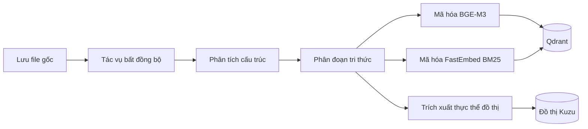
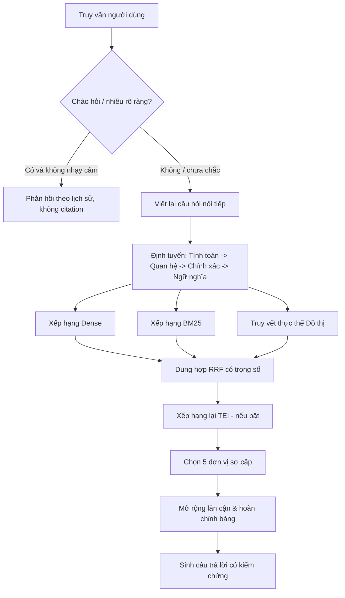
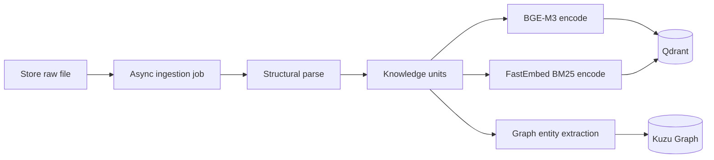
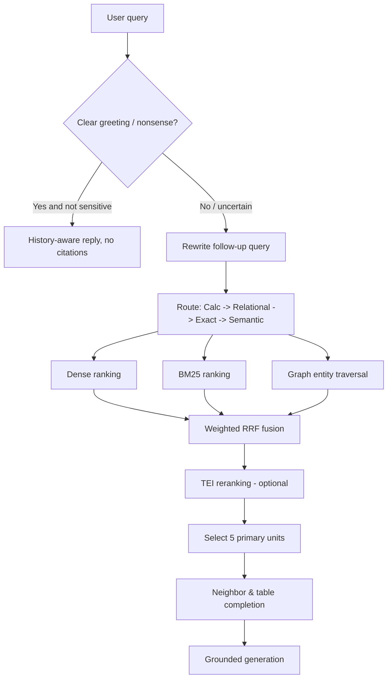

# Ingestion and retrieval

[Documentation index](README.md) · [Development](DEVELOPMENT.md) · [Architecture](ARCHITECTURE.md)

> **Ngôn ngữ / Language:** [Tiếng Việt](#hấp-thụ-và-truy-hồi--tiếng-việt) · [English](#ingestion-and-retrieval-1)

---

## Hấp thụ và truy hồi — Tiếng Việt

Tài liệu này mô tả pipeline RAG xử lý tài liệu kỹ thuật số của OpenVie. Hệ thống **không** hỗ trợ OCR, hình ảnh, âm thanh hay video.

### 1. Ngăn xếp mô hình và lưu trữ

| Năng lực | Triển khai | Ghi chú |
|---|---|---|
| Sinh văn bản, trích xuất đồ thị, lập kế hoạch tính toán | Chat model adapter: `ollama` hoặc `qwen` | Mặc định là Ollama với `vylinh` (3.09B). `qwen` trỏ tới endpoint tương thích OpenAI bên ngoài. |
| Vector dày (Dense embeddings) | Adapter Ollama `/api/embed` | Mặc định là `bge-m3` (1024 chiều). |
| Truy hồi từ vựng (Lexical/Sparse) | FastEmbed `Qdrant/bm25` | Bổ sung cho ngữ nghĩa đối với từ ngữ chính xác, mã hiệu, ngày tháng. |
| Xếp hạng lại (Reranking - tùy chọn) | TEI cross-encoder endpoint | Mặc định `Alibaba-NLP/gte-multilingual-reranker-base`. Hỗ trợ tiếng Việt, cơ chế fail-open khi lỗi. |
| Phân tích tài liệu số | Parser chuyên biệt: `pypdf`, `python-docx`... | Trích xuất văn bản có cấu trúc kèm nguồn gốc (provenance). |
| Chỉ mục vector | Qdrant named vectors (dense + sparse) | Giới hạn theo tenant, knowledge base và document. |
| Đồ thị tri thức (Graph) | Kuzu chạy ngầm sau graph-service | Thực thể và quan hệ được neo bằng bằng chứng trong tài liệu. |

### 2. Nguồn tài liệu được chấp nhận

- **Định dạng hỗ trợ:** PDF có text (`.pdf`), Word (`.docx`), Văn bản thuần (`.txt`), Markdown (`.md`), HTML (`.html`), Bảng tính (`.xlsx`, `.csv`). Giới hạn **20 MB/tệp**.
- **Không hỗ trợ:** PDF scan/ảnh thuần, PDF mã hóa, định dạng nhị phân cũ (`.doc`, `.xls`), file nén độc hại/hư hỏng.

### 3. Quy trình hấp thụ bất đồng bộ

- **Trạng thái:** `PENDING` → `PROCESSING` → `COMPLETED` (hoặc `FAILED`).
- **Idempotency:**
  - File trùng SHA-256 trong cùng KB: trả về tài liệu hiện có, bỏ qua xử lý lại.
  - File cùng tên nhưng nội dung thay đổi: cập nhật tại chỗ, chuyển lại `PENDING`, ghi đè nguồn và thay thế vector/graph tương ứng.
- **Giới hạn tài nguyên:** `INGESTION_WORKER_CONCURRENCY` (mặc định 4) điều tiết số tài liệu xử lý đồng thời. `GRAPH_EXTRACTION_MAX_OUTPUT_TOKENS` (512) giới hạn token sinh ra mỗi batch trích xuất đồ thị (tối đa 2 thực thể, 2 quan hệ mỗi đơn vị tri thức).

### 4. Xử lý cấu trúc và bảng tính

- **Phân đoạn (Chunking):** Đoạn văn thông thường cắt ở **800 ký tự với 120 ký tự gối đầu (overlap)**. Bảng biểu, tiêu đề, danh sách dùng overlap bằng 0 và tôn trọng ranh giới dòng. Bảng bị cắt sẽ lặp lại dòng tiêu đề (header) để giữ ngữ cảnh.
- **Bảng tính (Spreadsheet):**
  - *Ngữ nghĩa:* Mỗi dòng được chuẩn hóa thành văn bản kèm metadata (Sheet, Range, Cột, Giá trị).
  - *Tính toán tiền kiểm định:* Với câu hỏi tính toán, mô hình lập kế hoạch JSON (`count`, `sum`, `average`, `min`, `max`, `sort`, `top`, `bottom`) và Polars thực thi an toàn trên dữ liệu Parquet. Không chạy code tùy ý.

### 5. Xử lý truy vấn lai (Hybrid Retrieval)

**Bộ lọc ý định:** Quy tắc Việt/Anh bảo thủ chỉ chặn lời chào, hội thoại xã giao hoặc nhiễu rõ ràng; bỏ qua cả cache câu trả lời, embedding, query planning, truy hồi và LLM. Phản hồi nhắc chủ đề gần nhất khi phù hợp, không citation. Câu hỏi nhạy cảm, mã/định danh và câu nối tiếp có nội dung vẫn đi qua RAG; khi chưa chắc, ưu tiên truy hồi. Đây không phải bộ phân loại ngữ nghĩa đã huấn luyện.

1. **Viết lại truy vấn theo ngữ cảnh (Query Planning):** Câu hỏi nối tiếp (follow-up) được viết lại thành truy vấn độc lập trước khi tìm kiếm dựa trên lịch sử hội thoại gần nhất.
2. **Định tuyến:** `calculation` → `relational` → `exact` → `semantic` với trọng số kênh tương ứng.
3. **Khai thác ứng viên:** Thu thập tối đa 40 dense, 40 sparse, 20 graph song song.
4. **Dung hợp (Fusion):** RRF với $k=30$, giữ lại 30 ứng viên tốt nhất.
5. **Reranking:** Tùy chọn xếp hạng lại bằng mô hình cross-encoder.
6. **Lựa chọn & Mở rộng:** Lấy 5 đơn vị sơ cấp (tối đa 2 đơn vị/tài liệu). Tự động kéo thêm các dòng lân cận cùng bảng (`table_id`) và ngữ cảnh lân cận, tối đa 8 đơn vị tri thức đưa vào prompt.

### 6. Nguyên tắc sinh phản hồi và đối soát

- **Liệt kê đầy đủ:** Prompt yêu cầu toàn bộ các mục, nhãn và thông số trong nguồn. Ngân sách câu trả lời mặc định là `LLM_MAX_OUTPUT_TOKENS=1024`; graph extraction giữ ngân sách riêng 512 token.
- **Trích dẫn có cấu trúc:** Câu trả lời dẫn nguồn `[S1]`, `[S2]`. Control plane kiểm tra tính hợp lệ và quyền truy cập tài liệu trước khi phát phản hồi cuối và thẻ nguồn.
- **Không tìm thấy:** Khi không có bằng chứng liên quan, mô hình từ chối suy đoán và thông báo thiếu thông tin.
- **Streaming thật:** Ollama NDJSON hoặc SSE từ endpoint tương thích OpenAI → gRPC server-streaming → SSE tới client. Bản nháp tích lũy thay thế snapshot cũ; giữ lại đuôi và token/placeholder chưa đủ để làm sạch trước khi hiển thị. Bản nháp không có link/thẻ nguồn và không được lưu.
- **Câu hỏi nhạy cảm:** Chờ toàn bộ kết quả, kiểm tra citation và cắt cụt trước khi hiển thị; câu trả lời bị cắt hoặc thiếu nguồn hợp lệ không lộ bản nháp.

---

# Ingestion and retrieval

This guide describes OpenVie's digital-document RAG implementation. OCR, general image, audio, and video ingestion are **not delivered**.

## 1. Current model and storage stack

| Capability | Implementation | Notes |
|---|---|---|
| Text generation, graph extraction, calculation planning | Chat model adapters: `ollama` or `qwen` | Default: native Ollama with `vylinh` (3.09B). `qwen` targets an external OpenAI-compatible endpoint. |
| Dense embeddings | Ollama `/api/embed` | Default: `bge-m3` (1024 dimensions). |
| Lexical retrieval | FastEmbed `Qdrant/bm25` | Complements semantic search for exact codes, identifiers, dates. |
| Reranking (optional) | TEI cross-encoder endpoint | Default: `Alibaba-NLP/gte-multilingual-reranker-base`. Fails open on errors. |
| Document parsing | Dedicated parsers: `pypdf`, `python-docx` | Extracts structured text with source provenance. |
| Vector index | Qdrant dense and sparse vectors | Filtered by tenant, knowledge base, and document ID. |
| Knowledge graph | Kuzu behind graph-service | Grounded entities and evidence-backed relations. |

## 2. Accepted knowledge sources

- **Supported:** PDF with extractable text (`.pdf`), Word (`.docx`), Plain text (`.txt`), Markdown (`.md`), HTML (`.html`), Spreadsheets (`.xlsx`, `.csv`). Size limit: **20 MB per file**.
- **Unsupported:** Scanned/image-only PDFs, encrypted PDFs, legacy binary files (`.doc`, `.xls`), corrupted archives.

## 3. Asynchronous ingestion

- **Statuses:** `PENDING` → `PROCESSING` → `COMPLETED` (or `FAILED`).
- **Idempotency:**
  - Identical SHA-256 within the same knowledge base: returns existing document without reprocessing.
  - Same filename with changed content: updates document in place, resets status to `PENDING`, and replaces vector/graph entities.
- **Resource limits:** `INGESTION_WORKER_CONCURRENCY` (default 4) governs document concurrency. `GRAPH_EXTRACTION_MAX_OUTPUT_TOKENS` (512) caps tokens per graph batch (max 2 entities, 2 relations per unit).

## 4. Structure and spreadsheet handling

- **Chunking:** Prose blocks target **800 characters with 120-character overlap**. Tables, headings, and code use zero character overlap. Fragmented tables repeat header lines to preserve context.
- **Spreadsheets:**
  - *Semantic representation:* Normalized rows include sheet name, cell range, headers, and values.
  - *Deterministic calculation:* Model plans restricted JSON operations (`count`, `sum`, `average`, `min`, `max`, `sort`, `top`, `bottom`) executed safely via Polars on derived Parquet files.

## 5. Hybrid query processing

**Intent gate:** Conservative Vietnamese/English rules short-circuit clear greetings, social-only messages, and nonsense before answer caches, embeddings, planning, retrieval, or LLM calls. Replies reference the recent topic when appropriate and carry no citations. Sensitive questions, codes/identifiers, and substantive follow-ups retain RAG; uncertainty defaults to retrieval. This is not a trained semantic classifier.

1. **Contextual Query Planning:** Follow-up questions are reformulated into standalone search queries based on recent conversation turns.
2. **Routing:** Order: `calculation` → `relational` → `exact` → `semantic` with profile-specific weights.
3. **Retrieval:** Fetches up to 40 dense, 40 sparse, and 20 graph candidates concurrently.
4. **Fusion:** Profile-weighted RRF with $k=30$, retaining top 30 candidates.
5. **Reranking:** Optional cross-encoder scoring.
6. **Selection & Expansion:** Selects 5 primary units (soft limit 2 per document), completed with structural table siblings (`table_id`) and eligible neighbors up to 8 total units.

## 6. Grounding and response behavior

- **Full Enumeration:** Prompt instructions require all listed items, identifiers, and values. Answer generation defaults to `LLM_MAX_OUTPUT_TOKENS=1024`; graph extraction keeps its independent 512-token budget.
- **Structured Citations:** Facts are marked with `[S1]`, `[S2]`. The control plane validates document visibility and ownership before emitting the authoritative final response and source cards.
- **Abstention:** If evidence is insufficient, the system abstains rather than hallucinating.
- **Native Streaming:** Ollama NDJSON or OpenAI-compatible SSE → server-streaming gRPC → client SSE. Cumulative polished snapshots replace previous drafts; an incomplete tail, token, or placeholder is withheld until it can be cleaned safely. Drafts have no links/source cards and are never persisted.
- **Sensitive Questions:** Full generation, citation, and truncation checks precede display; truncated or unauthorized sensitive answers expose no draft.

## 7. Implementation map

| Concern | Primary source files |
|---|---|
| Upload & lifecycle | `DocumentService.java`, `DocumentFileValidator.java` |
| Parsing & chunking | `extraction.py`, `chunking.py`, `pipeline.py` |
| Model adapters | `chat.py`, `embedding.py`, `sparse.py` |
| Intent, retrieval & planning | `intent.py`, `query_plan.py`, `retrieval.py`, `reranking.py` |
| Graph projection | `entity_extraction.py`, `search.py` |
| Calculation engine | `calculation.py`, `spreadsheets.py` |
