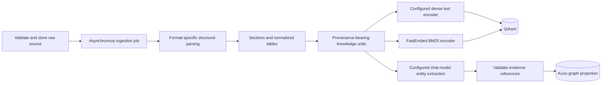
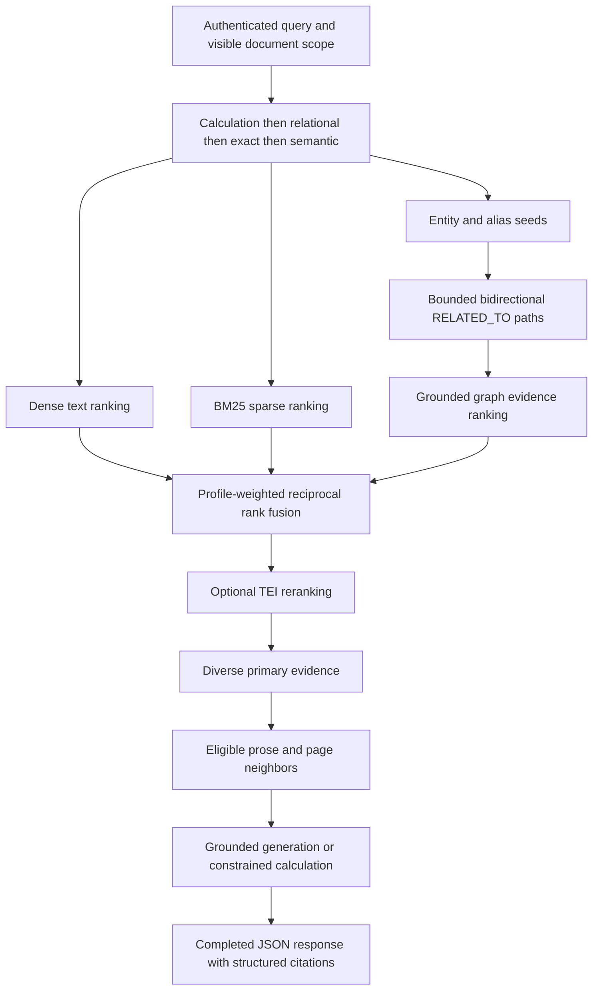

# Ingestion and retrieval

[Documentation index](README.md) · [Development](DEVELOPMENT.md) · [Architecture](ARCHITECTURE.md)

This guide describes OpenVie's delivered digital-document RAG path. Image, OCR, audio, and video
knowledge ingestion are **not delivered** and are not additional formats accepted by the current
document API. For setup and configuration, start with [Development](DEVELOPMENT.md#local-setup).

## Contents

- [Current model and storage stack](#current-model-and-storage-stack)
- [Accepted knowledge sources](#accepted-knowledge-sources)
- [Asynchronous ingestion](#asynchronous-ingestion)
- [Structure and spreadsheet handling](#structure-and-spreadsheet-handling)
- [Deletion behavior](#deletion-behavior)
- [Hybrid query processing](#hybrid-query-processing)
- [Grounding and response behavior](#grounding-and-response-behavior)
- [Caching](#caching)
- [Implementation map](#implementation-map)

## Current model and storage stack

The runtime integrates pretrained models; it does not contain a model-training pipeline. Generation
is **not self-hosted-only** and is not fixed to Gemma 4. Select providers and model identifiers in
[settings](../rag-chatbot-fastapi/app/bootstrap/settings.py) and deployment configuration.

| Capability | Delivered implementation | Boundary |
|---|---|---|
| Answer generation, graph extraction, and calculation planning | Configured chat-model adapters: `ollama` or `qwen` | `qwen` targets an externally managed OpenAI-compatible endpoint; Ollama supports native chat or its compatibility endpoint. A provider name alone does not install a model. |
| Dense text embeddings | Ollama `/api/embed` adapter; BGE-M3 with 1,024-dimensional vectors is the configured settings default | Embeds extracted text, not files; validates returned vector count and dimension. The configured model identifier must exist on the embedding server. |
| Lexical retrieval | FastEmbed `Qdrant/bm25` sparse encoder | Complements semantic retrieval for literal wording, identifiers, dates, and values. |
| Optional reranking | TEI cross-encoder endpoint; `Alibaba-NLP/gte-multilingual-reranker-base` is the portable default | Disabled by default and fail-open. The default explicitly supports Vietnamese; operators may select another TEI-compatible model only after measuring retrieval quality and latency. |
| Digital-document parsing | Format-specific parsers, including `pypdf` and `python-docx` | Do not assume a Docling/OCR pipeline is installed. |
| Vector index | Qdrant dense and sparse named vectors | Tenant, knowledge-base, and document scope constrain retrieval. |
| Knowledge graph | Kuzu behind the graph service | Evidence-linked entities and relationships, not unconstrained model-memory facts. |
| Model orchestration | Internal LangChain adapters where used | Internal dependency, not a public API contract. |

The generative model is separate from the text embedding model. Changing a model identifier or
embedding dimension is not a documentation rename: it affects compatibility with indexed vectors
and cache scope. See [Development configuration](DEVELOPMENT.md#configuration) and
[caches](ARCHITECTURE.md#caches). vLLM was part of a proposed model-serving design; it is not a
required runtime for every supported provider.

OpenVie application source is Apache-2.0 under the repository [LICENSE](../LICENSE),
copyright 2026 LinkedNodeDigital. Open-source infrastructure, model weights, and third-party
dependencies retain their own licenses and are not redistributed under the application's license.

## Accepted knowledge sources

| Current source | Extensions | Processing |
|---|---|---|
| Text-bearing PDF | `.pdf` | Extract page text and provenance; structure-aware chunks |
| Word document | `.docx` | Paragraphs, headings, lists, and tables |
| Plain text | `.txt` | UTF-8 text, paragraph blocks |
| Markdown | `.md`, `.markdown` | Structural text blocks |
| HTML | `.html`, `.htm` | Extracted text and document structure |
| Spreadsheet | `.xlsx`, `.csv` | Logical tables, schema, rows, and cell provenance; constrained calculations |

The Java upload service enforces **20 MB** per file. It validates the supported extension, accepted
MIME type, and format-specific content: PDF signature, Office archive structure and expansion safety,
or UTF-8 text without binary NUL content. Generic `application/octet-stream` is accepted for supported
formats, so this is not a claim that the supplied MIME type proves the file's contents.

Encrypted PDFs, scanned-only PDFs without extractable text, legacy `.doc`/`.xls`, and unsafe or
malformed Office archives are unsupported. Some failures are discovered during asynchronous parsing,
not necessarily at the initial upload request. Uploaded content remains untrusted data.

Do not describe every upload as malware-scanned: the current validation path does not call a malware
scanner. A settings flag or future worker-kind name is not evidence that an ingestion capability exists.
See the [upload validator](../api/src/main/java/com/cacanode/api/document/service/DocumentFileValidator.java)
and [parsers](../rag-chatbot-fastapi/app/modules/ingestion/internal/extraction.py) for exact behavior.

## Asynchronous ingestion

An accepted upload stores the raw source and schedules ingestion; success of the upload request does
not mean the knowledge is ready for chat. Persisted document statuses are:

```text
PENDING -> PROCESSING -> COMPLETED
PENDING -> FAILED
PROCESSING -> FAILED
```

### Upload idempotency and updates

Document uploads identify documents by file name within a knowledge base:
- **Identical content:** If a file with identical SHA-256 content is uploaded to the same knowledge base, the API performs a no-op: it returns the existing document record immediately without re-storing files in SeaweedFS, re-embedding in Qdrant, or re-extracting graph entities.
- **Modified content:** If a file with the same name has modified content, the API updates the existing document in place (preserving its document ID), transitions its status back to `PENDING` with a new job ID, overwrites the stored source, and schedules re-ingestion. The downstream worker then replaces index points in Qdrant and graph entities in Kuzu for that document ID, preventing duplicate records or orphaned vectors.
- **In-progress uploads:** Re-uploading an identical file while processing is underway returns the active document; re-uploading modified content while processing is in flight is rejected until the current job finishes.
Public status data identifies the document/job, file name/type/size, knowledge base,
current status, upload time, successful chunk count, and safe failure message as applicable;
the Spring document API is the contract for those fields. Redis worker checkpoints separately track
processing publication, index replacement, graph replacement, completion publication, cleanup, and
terminal failure; they are not extra public document statuses.



Worker concurrency is configuration, not a fixed property. `INGESTION_WORKER_CONCURRENCY`
(default `4`) is the maximum number of documents a worker processes at once and is also the
RabbitMQ prefetch count; set it to `1` when the model server is serial. Graph extraction is
chat-model work, not embeddings: it dominates ingestion time, and its cost grows with document
size because each chunk contributes entities and relations to the response.
`GRAPH_EXTRACTION_MAX_OUTPUT_TOKENS` (default `1024`) bounds that response per batch, and
`GRAPH_EXTRACTION_BATCH_SIZE` (default `4`) sets how many chunks share a request. Raising
concurrency only helps when the serving model accepts parallel requests.

## Structure and spreadsheet handling

A knowledge unit retains source/document identity, file name, section and heading context, page number
when applicable, source offsets, content hash, and parser/chunker version. Table and spreadsheet units
also retain table identity, headers, sheet name, and cell range where available. Provenance depends on
the source format; not every field exists for every unit.

Oversized prose/page blocks target **800 characters with 120-character overlap**. Structural headings,
lists, code, tables, spreadsheet rows, and sheet records use zero character overlap and prefer line or
row boundaries. A non-table line longer than the target is hard-split without overlap; a table row is
kept intact even if its fragment exceeds the target. Split tables repeat headers so each fragment
remains interpretable and citable. The rules live in
[chunking.py](../rag-chatbot-fastapi/app/modules/ingestion/internal/chunking.py).

Spreadsheets have two complementary representations:

1. **Semantic evidence:** table summaries and normalized rows carry the source workbook name, sheet,
   header, range, and values as retrievable text. For example:

   ```text
   Sheet: Kho hàng; Range: A14:D14; Mã SP: SP-014; Tên sản phẩm: Máy in laser; Tồn kho: 50
   ```

   The summary block for the same table reads
   `Sheet: Kho hàng; Range: A14:D14; Columns: Mã SP (string), Tên sản phẩm (string), Tồn kho (int)`.

2. **Deterministic calculations:** the model may plan a restricted JSON operation against a retrieved
   table; validated code executes it with Polars. Supported operations are `count`, `sum`, `average`,
   `minimum`, `maximum`, `sort`, `top`, and `bottom`, with validated filters and optional grouping.
   Unknown columns and invalid filter types are rejected. The model explains the result rather than
   executing arbitrary code.

The parser discovers logical tables across blank row/column bands, normalizes duplicate headers,
infers primitive types, and records formula cells. It does **not** evaluate spreadsheet formulas.
Neither generated Python, SQL, shell commands, nor unrestricted expressions are calculation inputs.
See the planner/executor split in
[calculation.py](../rag-chatbot-fastapi/app/modules/generation/internal/calculation.py) and
[spreadsheets.py](../rag-chatbot-fastapi/app/modules/generation/internal/spreadsheets.py).

## Deletion behavior

Deletion is tenant-scoped and restricted to tenant admins. Current behavior is narrower than a
universal deletion design:

- `PENDING` and `PROCESSING` documents cannot be deleted; wait for processing to finish.
- Completed-document deletion removes vector/graph indexes and raw storage before removing the
  document record. Search revision and document caches are updated.
- Failed-document deletion removes the record and requests index/storage cleanup through an event;
  cleanup errors are logged rather than making that path equivalent to synchronous cleanup.
- Source-owned graph relationships are removed while entities still supported by other sources remain.
- A repeated delete of an absent document is not promised to succeed: the service returns not found.

See [DocumentService](../api/src/main/java/com/cacanode/api/document/service/DocumentService.java),
[failed cleanup listener](../api/src/main/java/com/cacanode/api/document/listener/FailedDocumentCleanupListener.java),
and [graph lifecycle](../rag-chatbot-fastapi/app/modules/graph/internal/service.py).

## Hybrid query processing

The control plane derives tenant identity, policy, knowledge revision, and document visibility from
trusted context. A tenant identifier supplied in request JSON is not authorization. Retrieval combines
three evidence channels, using a deterministic router rather than a learned classifier.



Current default retrieval policy (not benchmark-tuned constants):

1. Route with precedence **calculation → relational → exact → semantic**.
2. Retrieve up to 40 dense, 40 sparse, and 20 graph candidates; channel operations run concurrently.
3. Fuse by profile-weighted RRF with `k=30`, deduplicating `(document_id, unit_id)`, retaining 30 candidates.
4. Optionally rerank through the configured TEI endpoint. The portable default is the 306M-parameter GTE multilingual cross-encoder; TEI installation and acceleration are platform-specific while the HTTP contract remains the same.
5. Select five primary units with a soft limit of two per document. Fill deferred candidates if diversity
   would otherwise leave the context incomplete.
6. Add at most three eligible prose/page neighbors, for at most eight units, each with citation metadata.

Graph search matches normalized entities and aliases, then follows grounded `RELATED_TO` evidence
in either direction for zero through three hops. It rejects cyclic paths and filters document scope
before the candidate limit. This is bounded evidence-grounded multi-hop retrieval, **not** community
summarization or global-search GraphRAG. See [graph search](../rag-chatbot-fastapi/app/modules/graph/internal/search.py)
for the implemented traversal and its limits.

Channel, reranker, and neighbor-expansion failures retain usable evidence where the implementation
can do so. This does not promise an answer through every outage: query embedding, absence of usable
evidence, model errors, and authoritative consistency checks can still prevent generation.

Candidate counts, weights, and flags are defined in
[settings](../rag-chatbot-fastapi/app/bootstrap/settings.py); their defaults are listed above and
are not benchmark-tuned constants.

## Grounding and response behavior

- Tenant-specific knowledge claims must use retrieved evidence; graph facts must reference valid source units.
- Answers carry structured citations, not only in-text markers. The Java control plane validates citation
  document ownership, completion, knowledge-base membership, and visibility before acceptance.
- An authoritative knowledge revision is checked across inference and persistence; a changed revision
  triggers one rebuilt-context retry.
- When no context is selected, the response is the unavailable-information answer rather than a
  guessed one. Calibrated score-based abstention is not implemented.
- Retrieved content is data, not permission to override tenant or chatbot policy. Prompt instructions
  and citation checks are safeguards, not a proof that model output is always correct.
- The chat submission contract returns a **completed JSON response**. It is not an SSE/token
  stream; streaming-oriented settings do not establish a working streaming endpoint.

The chatbot row stores a `general_knowledge_policy` value, but no enforcement path consumes it
today; do not document it as a working feature. See
[generation service](../rag-chatbot-fastapi/app/modules/generation/internal/service.py) for prompt
and no-information behavior.

## Caching

Do not assume all generated answers bypass caches. OpenVie implements embedding and retrieval caches,
plus an **optional semantic answer cache** with `off`, `shadow`, and `serve` modes. Defaults leave the
optional caches disabled. The semantic answer cache has an exact-query tier and a vector-similarity
tier; only eligible grounded answers may be reused, with scope, visibility, revision, literal, and expiry
guards. Queries with action intent or on the calculation route are rejected before any cache
lookup or write.

Operational defaults, switches, failure behavior, and rollout gates are covered in
[architecture · caches](ARCHITECTURE.md#caches).

## Implementation map

| Concern | Source |
|---|---|
| Upload validation and lifecycle | [DocumentService.java](../api/src/main/java/com/cacanode/api/document/service/DocumentService.java), [DocumentFileValidator.java](../api/src/main/java/com/cacanode/api/document/service/DocumentFileValidator.java) |
| Parsing, chunking, ingestion | [extraction.py](../rag-chatbot-fastapi/app/modules/ingestion/internal/extraction.py), [chunking.py](../rag-chatbot-fastapi/app/modules/ingestion/internal/chunking.py), [pipeline.py](../rag-chatbot-fastapi/app/modules/ingestion/internal/pipeline.py) |
| Model adapters | [chat.py](../rag-chatbot-fastapi/app/modules/model/internal/chat.py), [embedding.py](../rag-chatbot-fastapi/app/modules/model/internal/embedding.py), [sparse.py](../rag-chatbot-fastapi/app/modules/model/internal/sparse.py) |
| Retrieval and reranking | [retrieval.py](../rag-chatbot-fastapi/app/modules/retrieval/internal/retrieval.py), [reranking.py](../rag-chatbot-fastapi/app/modules/retrieval/internal/reranking.py) |
| Graph extraction and search | [entity_extraction.py](../rag-chatbot-fastapi/app/modules/ingestion/internal/entity_extraction.py), [search.py](../rag-chatbot-fastapi/app/modules/graph/internal/search.py) |
| Calculation execution | [calculation.py](../rag-chatbot-fastapi/app/modules/generation/internal/calculation.py), [spreadsheets.py](../rag-chatbot-fastapi/app/modules/generation/internal/spreadsheets.py) |

Follow [Java module rules](../api/GUIDE.md) and [Python module rules](../rag-chatbot-fastapi/GUIDE.md)
when changing these implementations; this guide does not replace those boundaries.
